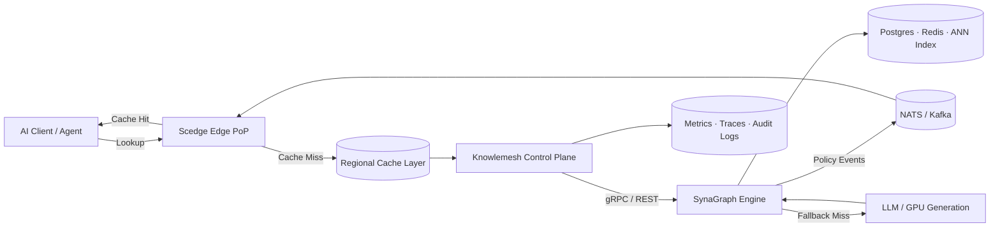
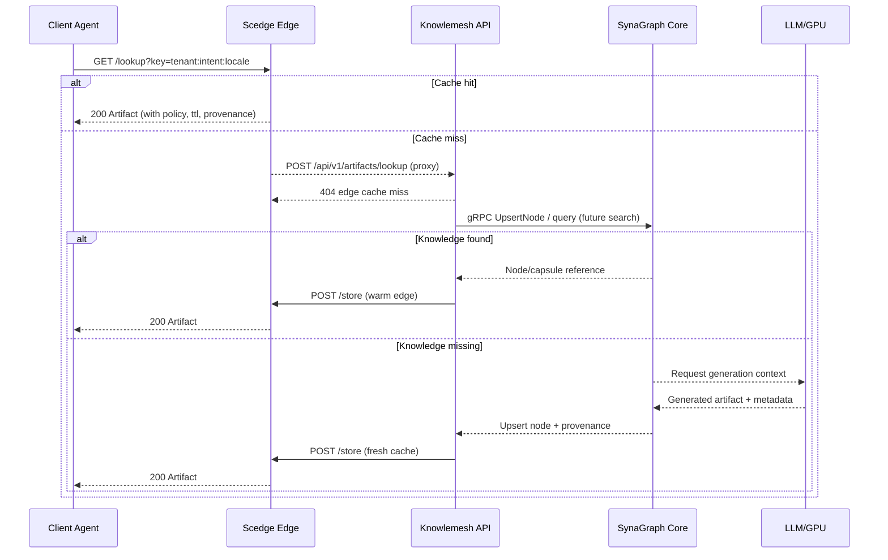
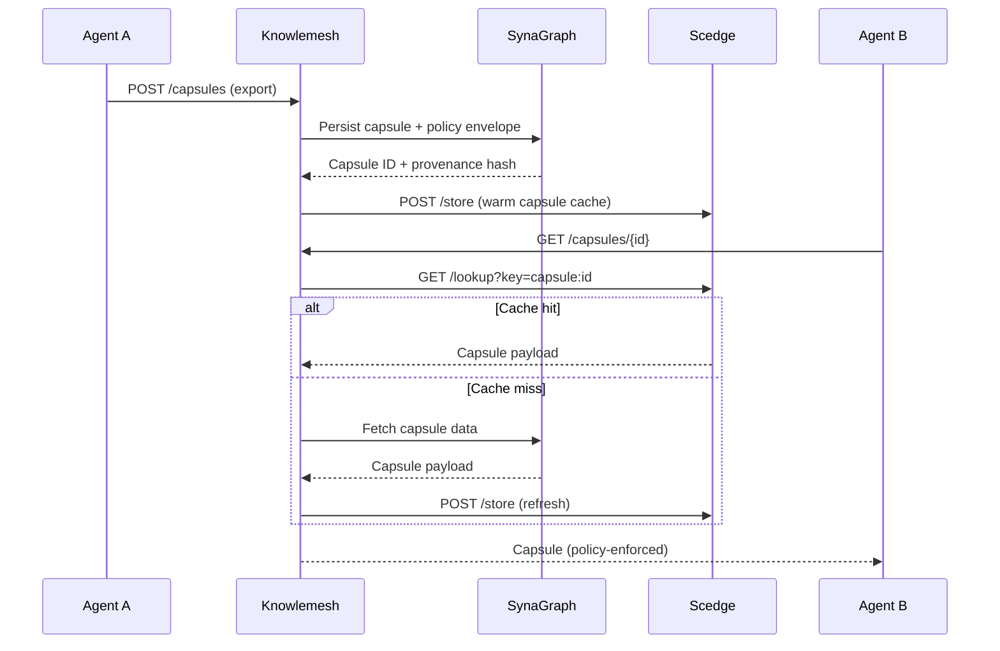
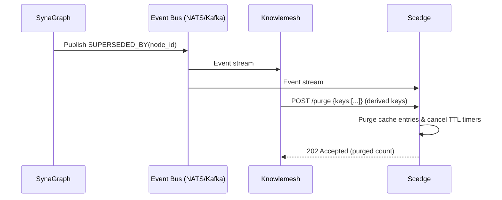

# Memophor Technical Blueprint
> Revision: 2025-03-28 · Status: Draft · Owners: Platform Architecture Guild

## 1. Purpose & Scope
Memophor delivers a distributed knowledge mesh that gives AI systems durable, policy-aware memory. This document captures the current technical state of the stack (as reflected in this repository) and lays out the architectural blueprint, operational model, and near-term build plan for the platform. It is intended for engineers, DevOps, and product stakeholders who need an end-to-end view of how the system fits together.

## 2. Platform Pillars
The platform is organized around four primary services and shared protocols.

| Component | Source | Language | Role | Current Interfaces |
|-----------|--------|----------|------|--------------------|
| **SynaGraph** | `synagraph/` | Rust | Synaptic knowledge engine (graph + vector + temporal store) | gRPC (`Ping`, `UpsertNode`), REST `/health` |
| **Knowlemesh** | `knowlemesh/` | Ruby on Rails (API-only) | Control plane for tenants, policy, orchestration | REST `/healthz`, `/api/v1/artifacts/{lookup,store,purge}` |
| **Scedge** | `scedge/` | Rust | Edge semantic cache (“knowledge CDN”) | REST `/lookup`, `/store`, `/purge` |
| **Context Capsule Protocol (CCP)** | `docs/ccp-v0.1.md` (spec) | JSON today → CBOR/Proto later | Portable context capsules exchanged between agents/services | REST/Streaming surfaces (planned) |

### Key Goals
- **Continuity:** Persist AI context, provenance, and policy at scale.
- **Efficiency:** Push answers as close to the user as possible, cutting redundant GPU or LLM calls by 70–95%.
- **Governance:** Enforce tenant, policy, and compliance constraints uniformly across the mesh.
- **Openness:** Build on open standards (REST, gRPC, eventual MCP integration) and maintain an open-core product strategy.

## 3. System Architecture

### 3.1 High-Level Flow

### 3.2 Architectural Themes
- **Cache-First:** Every inference request starts at Scedge; only misses traverse to Knowlemesh and SynaGraph.
- **Policy Everywhere:** Capsules, cache entries, and graph nodes all carry policy metadata that drives enforcement.
- **Event-Driven Coherence:** SynaGraph emits supersede/policy events over NATS/Kafka so that caches stay consistent.
- **Shared Contracts:** Protobuf definitions (`synagraph/proto/*.proto`) and future CCP schemas are versioned and reused across repos.

## 4. Component Deep Dives

### 4.1 SynaGraph (Core Memory Engine)
- **Responsibilities:** Graph-structured knowledge storage, semantic embeddings, temporal decay/reinforcement schedules, provenance tracking, and policy-aware supersede logic.
- **Current Scaffold:**
  - Rust + Tonic gRPC server (`synagraph/src/server/grpc.rs`) exposing `Ping` and `UpsertNode` operations defined in `synagraph/proto/synagraph.proto`.
  - REST `/health` endpoint served via Axum (`synagraph/src/server/http.rs`) for readiness.
  - Domain model `KnowledgeNode` (`synagraph/src/domain/node.rs`) storing node id, kind, payload, and creation state.
  - Configurable ports and metadata via `HTTP_ADDR`, `GRPC_ADDR`, `SERVICE_NAME`, `SERVICE_VERSION` (see `synagraph/src/config.rs`).
- **Planned Enhancements:**
  - Persistent backends (PostgreSQL for metadata, Redis/RocksDB for caching, disk-backed ANN index for vectors).
  - Temporal decay jobs and reinforcement API to promote frequently used nodes.
  - Policy compilation to WASM for inline enforcement across gRPC/REST surfaces.
  - Event emission (via NATS/Kafka) for invalidation, audit, and analytics streams.
- **Observability:** Structured logging (`tracing`) and future OpenTelemetry exporters for metrics/traces.

### 4.2 Knowlemesh (Control Plane)
- **Responsibilities:** Tenant lifecycle, policy orchestration, API key management, cache directives, analytics, billing integrations, and governance workflows.
- **Current Scaffold:**
  - Rails 7 API-only app with `/healthz` (`knowlemesh/app/controllers/health_controller.rb`).
  - `Api::V1::ArtifactsController` proxies `lookup`, `store`, and `purge` calls to Scedge (via `EdgeCache::Client` in `app/services/edge_cache/client.rb`).
  - Edge cache client uses environment `SCEDGE_URL` to route requests and performs JSON parsing + error normalization.
  - Routes defined in `knowlemesh/config/routes.rb`; service version handled via `SERVICE_VERSION` or default `0.1.0`.
- **Planned Enhancements:**
  - Active Record models for tenants, policies, API credentials, audit logs, and billing artifacts.
  - Authentication (API keys/JWT/OAuth) and fine-grained authorization for capsule + cache operations.
  - Dashboards and analytics endpoints (potential SPA integration).
  - Federation support to orchestrate multiple SynaGraph clusters and regional Scedge tiers.

### 4.3 Scedge (Edge Cache)
- **Responsibilities:** Serve low-latency cache hits, enforce TTL/policy, subscribe to supersede events, and handle regional cache invalidation.
- **Current Scaffold:**
  - Rust + Axum service with `/lookup`, `/store`, `/purge` endpoints (`scedge/src/main.rs`).
  - `CacheState` (`scedge/src/state.rs`) maintains in-memory map with TTL normalization, background janitor (`spawn_janitor`) respecting `SCEDGE_JANITOR_SECONDS`.
  - Artifact schema (`scedge/src/model.rs`) captures content, provenance, policy, confidence, TTL, ETag, metadata.
  - Structured error handling via `AppError` (`scedge/src/error.rs`).
  - Configuration from environment: `SCEDGE_ADDR`, `SCEDGE_DEFAULT_TTL`, `SCEDGE_JANITOR_SECONDS` (`scedge/src/config.rs`).
- **Planned Enhancements:**
  - Redis/KeyDB-backed cache, optional disk persistence, and per-tenant quotas.
  - Semantic nearest-neighbor lookups (ANN) and personalization templates.
  - Event bus integration to receive SynaGraph `SUPERSEDED_BY`/policy updates and cascade invalidations.
  - Observability stack (Prometheus metrics, OpenTelemetry logs/traces).

### 4.4 Context Capsule Protocol (CCP)
- **Purpose:** Provide a portable, signed bundle that captures summaries, provenance, policy, embeddings, and TTL so agents can exchange context without restating history.
- **Current Spec:** `docs/ccp-v0.1.md` defines JSON representation (v0.1) with roadmap to CBOR/Protobuf encodings. Capsule includes `capsule_id`, `tenant`, `scope`, `summary`, `graph_refs`, `policy`, `signature`.
- **Operations (planned):** `/capsules` export, fetch, query, revoke endpoints across REST/gRPC; eventual streaming surfaces for high-throughput exchanges.
- **Integration Points:**
  - SynaGraph stores canonical capsules and enforces policy/persistence.
  - Knowlemesh manages capsule lifecycle, tenancy, and audit.
  - Scedge caches capsules for low-latency handoffs.

### 4.5 GPU / LLM Fallback Layer
- Activated only on cache misses or when policy requires regeneration.
- Outputs new artifacts/capsules fed back into SynaGraph and pushed to Scedge.
- Future work: integrate reinforcement signals based on downstream consumption metrics.

## 5. Data Flow Scenarios

### 5.1 Primary Request Pipeline

### 5.2 Context Capsule Lifecycle

### 5.3 Cache Invalidation & Policy Update

## 6. Deployment & Operations

### 6.1 Environments
| Environment | Purpose | Core Components | Notes |
|-------------|---------|-----------------|-------|
| **Local Dev** | Individual developer workflows | Run services independently via `cargo run` / `bin/rails server`; optional docker-compose for dependencies | Uses in-memory stores; mock message bus |
| **Staging** | Integrated validation before release | All services, managed Postgres/Redis, shared NATS/Kafka | Nightly fixture sync; feature flags for experimental protocols |
| **Production** | Multi-region, tenant-facing | Regional Scedge PoPs, Knowlemesh control plane cluster, SynaGraph shards, GPU fallback pools | FedRAMP/HIPAA controls, dedicated observability + SIEM |

### 6.2 Infrastructure Stack (Target)
- **Compute:** Kubernetes (1 cluster per region) with Rust services deployed as stateless deployments, Rails as API pods, autoscaling enabled.
- **Data Stores:**
  - PostgreSQL for Knowlemesh metadata and SynaGraph relational state.
  - Redis/KeyDB for Scedge and hot-path caching.
  - Disk-backed ANN index (HNSWlib/DiskANN) for vector recall.
- **Messaging:** NATS JetStream or Kafka for policy/invalidation broadcasts and audit trails.
- **Observability:** OpenTelemetry collectors, Prometheus metrics, Grafana dashboards, Loki or ELK for logs.
- **Secrets & Config:** HashiCorp Vault or AWS Secrets Manager; environment variables injected per pod.
- **CI/CD:** GitHub Actions/GitLab CI building containers, running `cargo check`, `cargo test`, `bundle exec rspec` (future), and integration suites.

### 6.3 Configuration Summary
| Service | Variable | Purpose | Default |
|---------|----------|---------|---------|
| SynaGraph | `HTTP_ADDR` | REST listener | `0.0.0.0:8080` |
| | `GRPC_ADDR` | gRPC listener | `0.0.0.0:50051` |
| | `SERVICE_NAME` | Health metadata | `synagraph` |
| | `SERVICE_VERSION` | Service version | `Cargo.toml` version |
| Knowlemesh | `SERVICE_VERSION` | Health/version reporting | `0.1.0` |
| | `SCEDGE_URL` | Downstream edge cache URL | `http://localhost:9090` |
| Scedge | `SCEDGE_ADDR` | Bind address | `0.0.0.0:9090` |
| | `SCEDGE_DEFAULT_TTL` | Default TTL seconds | `300` |
| | `SCEDGE_JANITOR_SECONDS` | Janitor sweep interval | `30` |

## 7. Security, Policy & Compliance
- **Authentication:** Tenant-scoped API keys or OAuth2 tokens managed by Knowlemesh (planned). All internal service-to-service traffic secured via mTLS.
- **Authorization:** Policy engine compiles declarative rules to WASM; enforced at Knowlemesh ingress and SynaGraph storage layer.
- **Encryption:** TLS everywhere; at-rest encryption for Postgres/Redis; capsule signatures leveraging Ed25519 (per CCP spec).
- **Auditing:**
  - Knowlemesh records API calls, cache directives, policy changes.
  - SynaGraph emits provenance + supersede events with unique IDs.
- **Compliance Targets:** HIPAA, GDPR, SOC2 Type II. Default posture denies caching of PHI unless explicit tenant-wide opt-in.

## 8. Implementation Plan (2025)

| Phase | Focus | Key Deliverables |
|-------|-------|------------------|
| **P0 – Hardening (Q2)** | Stabilize scaffolds | Persistent storage adapters for SynaGraph; Redis-backed Scedge; Rails models for tenants/policies; shared protobuf packaging |
| **P1 – Policy & Capsules (Q3)** | Governance + context fidelity | WASM policy runtime; CCP export/fetch endpoints; capsule signing/verification SDKs (Rust/Python); audit log pipeline |
| **P2 – Edge Intelligence (Q4)** | Advanced caching & analytics | ANN semantic lookups; RAG template caching; OpenTelemetry dashboards; regional cache federation |
| **P3 – Enterprise Readiness (Q1 2026)** | Multi-region & compliance | FedRAMP-ready deployment patterns; billing integration; SLA monitoring + alerting |

### Immediate Backlog (Next 6 Weeks)
1. **SynaGraph** – Implement PostgreSQL adapter + migrations; expose `/nodes/{id}` REST read path; publish Dockerfile.
2. **Scedge** – Swap in Redis store (with feature toggle); add Prometheus metrics endpoint; implement purge-by-prefix helper.
3. **Knowlemesh** – Add `Tenant`, `Policy`, `ApiClient` models; integrate JWT auth filter; wrap EdgeCache client with circuit-breaker.
4. **CCP** – Finalize JSON Schema v0.1; publish reference implementation + integration tests across services.
5. **Ops** – Stand up dev/staging Kubernetes clusters; configure GitHub Actions pipeline with `cargo fmt/check`, `bundle exec rake`, and container builds.

## 9. Testing & Observability Strategy
- **Unit Tests:** Continue building Rust `#[cfg(test)]` suites (`synagraph/src/server/grpc.rs`, `scedge/src/state.rs`) and RSpec for Rails controllers/services.
- **Contract Testing:**
  - Validate gRPC schemas with Buf or grpcurl smoke tests.
  - JSON Schema validation for CCP payloads.
- **Integration Testing:** Compose docker-compose stack (SynaGraph + Scedge + Knowlemesh + Redis/Postgres) and run scenario tests covering cache hits/misses, invalidations, capsule lifecycle.
- **Load & Chaos:** Gatling/K6 scenarios to stress Scedge TTL behavior; chaos experiments that drop event bus messages to ensure eventual consistency.
- **Observability Hooks:** Unified tracing IDs propagated via headers; metrics for cache hit ratio, TTL distribution, policy rejections, LLM fallback count.

## 10. Risks & Mitigations
| Risk | Impact | Mitigation |
|------|--------|------------|
| Event bus unavailability | Stale caches → policy violations | Local TTL enforcement; exponential backoff + reconciliation jobs that poll SynaGraph |
| TTL misconfiguration | Cache bloat or premature eviction | Centralized config via Knowlemesh; dynamic TTL tuning based on usage analytics |
| Policy engine complexity | Slow adoption, errors | Start with simple rule DSL; provide simulation mode + audit previews |
| Capsule schema drift | Incompatible clients | Strict schema registry + version negotiation (JSON Schema, content-type suffix) |
| Multi-region latency | Slow writes to origin | Use regional SynaGraph replicas + eventual consistency with conflict resolution heuristics |

## 11. Reference Materials
- `docs/architecture.md` – High-level overview of the mesh.
- `docs/context.md` – Company mission and component summaries.
- `docs/ccp-v0.1.md` – CCP draft specification.
- `docs/roadmap.md` – Initial roadmap baseline.
- Source directories: `synagraph/`, `knowlemesh/`, `scedge/` as detailed above.

---
_For questions or updates, open a `docs` PR or ping the Platform Architecture Guild._
